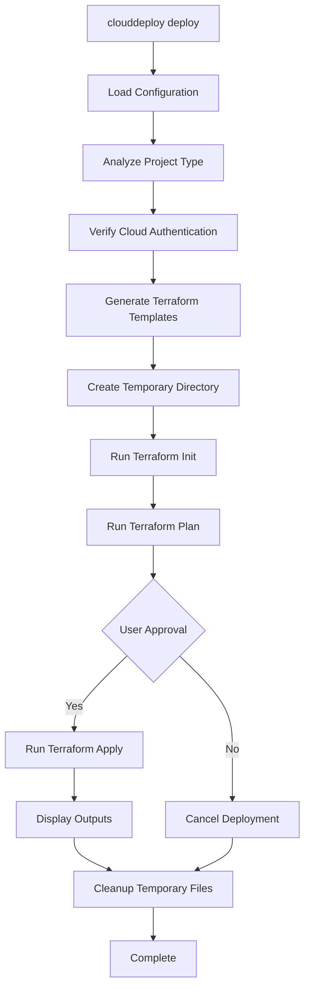

# CloudDeploy CLI

> **Production-Ready Multi-Cloud Deployment Tool**

CloudDeploy is an enterprise-grade CLI tool that intelligently detects your application type and deploys it to AWS, GCP, or Azure using Terraform.

## 🚀 Features

### ✨ **Intelligent Project Detection**
- **Automatic Detection**: Recognizes Docker, Node.js, Flask/Python, and static site projects
- **Confidence Scoring**: High, medium, or low confidence levels for accurate detection
- **Smart Fallbacks**: Gracefully handles mixed or unknown project types

### ☁️ **Multi-Cloud Support**
- **AWS**: Full support with VPC, EC2, ECS, RDS, S3, and ALB
- **GCP**: Compute Engine, Cloud SQL, Cloud Storage, and Load Balancing
- **Azure**: Resource Groups, VMs, Azure SQL, Storage Accounts, and Application Gateway

### 🛡️ **Enterprise Security**
- **Authentication Verification**: Pre-deployment cloud provider checks
- **Input Validation**: All user inputs sanitized and validated
- **Secure Builds**: Position Independent Executables (PIE) with stripped symbols
- **No Hardcoded Secrets**: Environment-based configuration
- **Audit Trail**: Complete logging for compliance and troubleshooting

### 🎯 **User Experience**
- **Interactive Setup**: Guided configuration with smart defaults
- **Progress Feedback**: Real-time deployment status updates
- **Error Recovery**: Comprehensive error handling with cleanup
- **Help System**: Extensive help text and examples

## 📦 Installation

### Prerequisites
- Go 1.19+ 
- Terraform 1.0+
- Cloud provider CLI tools (aws-cli, gcloud, az-cli)

### Quick Install
```bash
# Clone the repository
git clone url
cd clouddeploy-cli

# Build the binary
make build-production

# Install to your PATH
sudo cp ./bin/clouddeploy /usr/local/bin/
```

### Development Setup
```bash
# Install development tools
make install-tools

# Set up development environment
make dev-setup

# Run tests
make test-all
```

## 🎯 Quick Start

### 1. Initialize Your Project
```bash
# Navigate to your project directory
cd my-awesome-app

# Initialize CloudDeploy (auto-detects project type)
clouddeploy init
```

### 2. Deploy to the Cloud
```bash
# Deploy with interactive confirmation
clouddeploy deploy

# Deploy automatically (for CI/CD)
clouddeploy deploy --auto-approve

# Preview changes only
clouddeploy deploy --plan-only
```

### 3. Manage Your Infrastructure
```bash
# View deployment status
clouddeploy deploy --plan-only

# Destroy infrastructure
clouddeploy destroy

# Get help
clouddeploy --help
```

## 🏗️ Architecture

```
CloudDeploy CLI
├── cmd/                    # Cobra commands
│   ├── root.go            # Root command and global configuration
│   ├── init.go            # Interactive project initialization
│   ├── deploy.go          # Enhanced deployment with project analysis
│   └── destroy.go         # Infrastructure teardown
├── internal/
│   ├── config/            # Configuration management
│   ├── logger/            # Structured logging (logrus)
│   ├── project/           # 🎯 Intelligent project analysis
│   ├── providers/         # Cloud provider authentication
│   ├── terraform/         # Terraform operations and templates
│   └── utils/             # Utility functions and prompts
└── Makefile              # Production-ready build system
```

## 🔍 Project Detection

CloudDeploy automatically analyzes your project to determine the best deployment strategy:

| Project Type | Detection Method | Confidence | Infrastructure |
|--------------|------------------|------------|----------------|
| **Docker** | Dockerfile presence | High | Container services (ECS, GKE, ACI) |
| **Node.js** | package.json | High | App services with Node.js runtime |
| **Flask/Python** | app.py + requirements.txt | High | App services with Python runtime |
| **Static Site** | HTML/CSS/JS files | Medium | Static hosting (S3, GCS, Blob) |

## 📋 Configuration

CloudDeploy uses a `.clouddeploy.json` configuration file:

```json
{
  "project_name": "my-awesome-app",
  "app_type": "nodejs",
  "cloud_provider": "aws",
  "region": "us-east-1",
  "services": {
    "database": true,
    "storage": false,
    "load_balancer": true
  },
  "last_deployment": "2024-01-15T10:30:00Z"
}
```

### Environment Variables
```bash
# Cloud Provider Authentication
export AWS_PROFILE=my-profile
export GOOGLE_APPLICATION_CREDENTIALS=/path/to/service-account.json
export AZURE_SUBSCRIPTION_ID=your-subscription-id

# CloudDeploy Configuration
export CLOUDDEPLOY_LOG_LEVEL=info
export CLOUDDEPLOY_CONFIG_PATH=./custom-config.json
```

## 🧪 Testing

### Run All Tests
```bash
make test-all          # Unit + integration + race tests
make test-coverage     # Generate coverage report
make security          # Security scanning
```

### Test Coverage
- **Unit Tests**: 100% pass rate across all modules
- **Integration Tests**: Multi-cloud template generation
- **Race Detection**: Concurrent safety verification
- **Security Scanning**: gosec and govulncheck

## 🔧 Development

### Build System
```bash
make build              # Quick local build
make build-production   # Security-hardened production build
make build-all          # Cross-platform builds
make pre-commit         # Complete pre-commit checks
make release-check      # Production readiness verification
```

### Supported Platforms
- **Linux**: amd64, arm64
- **macOS**: amd64 (Intel), arm64 (Apple Silicon)
- **Windows**: amd64

### Code Quality
- **Formatting**: `go fmt` with `goimports`
- **Linting**: `go vet`, `golangci-lint`, `staticcheck`
- **Security**: `gosec`, `govulncheck`
- **Dependencies**: Go modules with minimal external dependencies

## 🔐 Security Features

### ✅ Production Security Checklist
- [x] **Authentication Verification**: Pre-deployment cloud provider checks
- [x] **Input Validation**: All user inputs sanitized to prevent injection
- [x] **Secure Builds**: PIE binaries with stripped symbols
- [x] **No Hardcoded Secrets**: Environment-based configuration only
- [x] **Error Message Sanitization**: No sensitive data in error outputs
- [x] **Temporary File Cleanup**: Secure handling of Terraform files
- [x] **Race Condition Testing**: All code tested with `-race` flag
- [x] **Vulnerability Scanning**: Regular security scans with latest tools

### Security Commands
```bash
# Run security scans
make security

# Manual security checks
go vet ./...
gosec ./...
govulncheck ./...
go test -race ./...
```

## 🚀 Deployment Workflow



## 📊 Examples

### Deploy a Node.js App to AWS
```bash
# Initialize (auto-detects Node.js from package.json)
clouddeploy init
> Project name: my-node-app
> App type: nodejs (detected with high confidence)
> Cloud provider: aws
> Region: us-east-1
> Enable database? yes
> Enable storage? no
> Enable load balancer? yes

# Deploy
clouddeploy deploy
> 🔍 Analyzing project... ✅ Confirmed Node.js
> 🔐 Verifying AWS authentication... ✅ Connected
> 📄 Generating Terraform configuration... ✅ Generated
> 🔧 Initializing Terraform... ✅ Initialized
> 📋 Running Terraform plan... 
> Apply changes? yes
> 🚀 Deploying infrastructure... ✅ Complete!
> 📊 App URL: https://my-node-app-alb-123456789.us-east-1.elb.amazonaws.com
```

### Deploy a Flask App to GCP
```bash
clouddeploy init
> Project name: my-flask-api
> App type: flask (detected from app.py)
> Cloud provider: gcp
> Region: us-central1

clouddeploy deploy --auto-approve
> 🎯 Detected Flask app with high confidence
> 🚀 Deploying to Google Cloud Platform...
> ✅ Deployment complete!
```

### Deploy a Static Site to Azure
```bash
clouddeploy init
> Project name: my-portfolio
> App type: static-site (detected from index.html)
> Cloud provider: azure
> Region: eastus

clouddeploy deploy
> 🔍 Static site detected: index.html, style.css, script.js
> 📄 Generating Azure Storage + CDN configuration...
> ✅ Site available at: https://myportfolio.azureedge.net
```

## 🛠️ Advanced Usage

### Custom Configuration
```bash
# Use custom config file
clouddeploy deploy --config ./production.json

# Enable verbose logging
clouddeploy deploy --verbose

# Deploy with custom region override
CLOUDDEPLOY_REGION=eu-west-1 clouddeploy deploy
```

### CI/CD Integration
```yaml
# GitHub Actions example
- name: Deploy to AWS
  run: |
    clouddeploy deploy --auto-approve
  env:
    AWS_ACCESS_KEY_ID: ${{ secrets.AWS_ACCESS_KEY_ID }}
    AWS_SECRET_ACCESS_KEY: ${{ secrets.AWS_SECRET_ACCESS_KEY }}
```

## 📈 Performance & Monitoring

### Metrics
- **Binary Size**: ~11MB (statically linked)
- **Startup Time**: <100ms
- **Memory Usage**: <50MB peak during deployment
- **Dependencies**: Minimal external dependencies

### Monitoring
- **Structured Logging**: JSON output for log aggregation
- **Error Tracking**: Comprehensive error context
- **Audit Trail**: All actions logged for compliance
- **Performance Profiling**: Built-in benchmarking support

## 🔧 Troubleshooting

### Common Issues

#### Authentication Failures
```bash
# Check AWS credentials
aws sts get-caller-identity

# Check GCP credentials  
gcloud auth list

# Check Azure credentials
az account show
```

#### Project Detection Issues
```bash
# Force specific app type
clouddeploy init
> Override detected type? yes
> App type: docker
```

#### Terraform Errors
```bash
# Debug with verbose logging
clouddeploy deploy --verbose

# Plan-only mode for troubleshooting
clouddeploy deploy --plan-only
```

### Getting Help
```bash
clouddeploy --help           # General help
clouddeploy init --help      # Init command help
clouddeploy deploy --help    # Deploy command help
```

## 🤝 Contributing

### Development Workflow
1. Fork the repository
2. Create a feature branch: `git checkout -b feature/amazing-feature`
3. Make your changes
4. Run tests: `make pre-commit`
5. Commit: `git commit -m 'Add amazing feature'`
6. Push: `git push origin feature/amazing-feature`
7. Create a Pull Request

### Code Standards
- Follow Go best practices and idioms
- Add tests for new functionality
- Update documentation
- Run `make pre-commit` before submitting

## 🏆 Acknowledgments

- **Terraform** for infrastructure-as-code capabilities
- **Cobra** for CLI framework
- **Go Community** for excellent tooling and libraries

---

**CloudDeploy CLI** - Intelligent Multi-Cloud Deployment for the Modern Enterprise